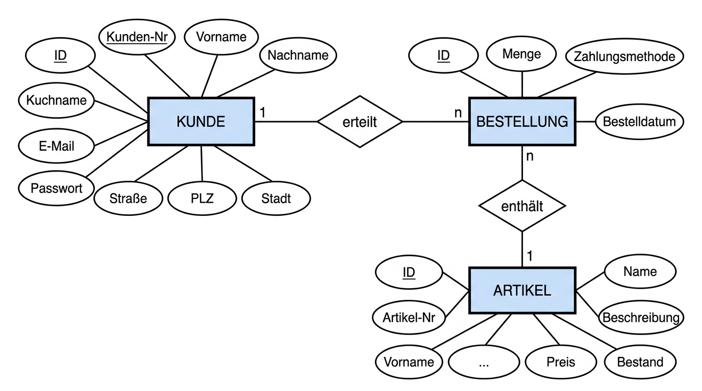
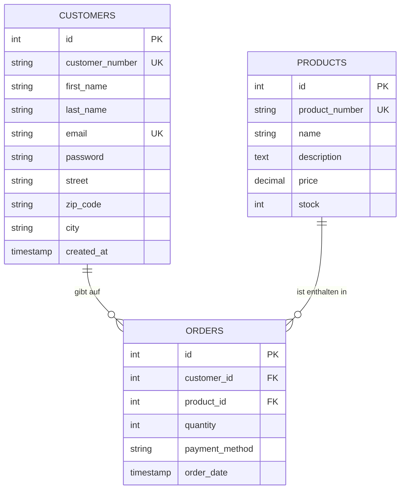

# PROJEKTDOKUMENTATION: BESE.CO Webshop
## Entwicklung einer E-Commerce Plattform für schwäbische Besen

**Fach:** Webentwicklung (HTML5, CSS3, PHP 8.x, MySQL)  
**Datum:** 05. Mai 2026  
**Version:** 1.0

---

## Inhaltsverzeichnis

- [Projektteam](#projektteam)
- [1. Einleitung](#1-einleitung)
  - [1.1 Ausgangssituation und Motivation](#11-ausgangssituation-und-motivation)
  - [1.2 Projektbeschreibung](#12-projektbeschreibung)
  - [1.3 Zielsetzung](#13-zielsetzung)
  - [1.4 Eingesetzte Technologien](#14-eingesetzte-technologien)
  - [1.5 Entwicklungsumgebung & Hilfsmittel](#15-entwicklungsumgebung--hilfsmittel)
  - [1.6 Funktionsübersicht (Kernfeatures)](#16-funktionsübersicht-kernfeatures)
- [2. Systemarchitektur & Datenbank](#2-systemarchitektur--datenbank)
  - [2.1 Datenbankmodell (ERM)](#21-datenbankmodell-erm)
  - [2.2 Beziehungen im Detail](#22-beziehungen-im-detail)
  - [2.3 Sicherheitskonzept](#23-sicherheitskonzept)
- [3. Technische Implementierung](#3-technische-implementierung)
  - [3.1 Dateistruktur](#31-dateistruktur)
  - [3.2 Seitenbeschreibung](#32-seitenbeschreibung)
  - [3.3 Ablauf einer Bestellung (Sequenz)](#33-ablauf-einer-bestellung-sequenz)
  - [3.4 Frontend-Design](#34-frontend-design)
- [4. Installationsanleitung (Lokale Entwicklung)](#4-installationsanleitung-lokale-entwicklung)
- [5. Benutzerführung (Anleitung für den Lehrer)](#5-benutzerführung-anleitung-für-den-lehrer)
- [6. Qualitätssicherung](#6-qualitätssicherung)
- [7. Stundenaufwand](#7-stundenaufwand)
- [8. Fazit & Ausblick](#8-fazit--ausblick)

---

## Projektteam

| Rolle | Name | Aufgabenbereich |
| :--- | :--- | :--- |
| **Projektleiter** | Vincent | Projektplanung, Koordination, Abnahme und Qualitätskontrolle |
| **Entwickler** | Angelo | Programmierung (Frontend & Backend), Datenbankdesign, Implementierung aller Features |
| **Qualitätssicherung (QA)** | Julia | Testen aller Funktionen, Fehlerprotokollierung, Kommunikation mit der Entwicklung |

---

## 1. Einleitung

### 1.1 Ausgangssituation und Motivation
Im Rahmen des Fachs Webentwicklung wurde das Team beauftragt, eine vollständige Webanwendung zu konzipieren, zu entwickeln und zu dokumentieren. Die Aufgabenstellung verlangte die Umsetzung einer dynamischen Website mit Datenbankanbindung, Benutzerverwaltung und einem interaktiven Bestellprozess.

Als Projektidee wurde ein fiktiver Online-Shop für handgefertigte Besen aus dem Schwarzwald gewählt. Der Name **BESE.CO** leitet sich vom schwäbischen Dialektwort "Bese" (hochdeutsch: Besen) ab und verleiht dem Shop einen regionalen, humorvollen Charakter. Damit hebt sich das Projekt bewusst von klassischen Webshop-Beispielen ab und zeigt, dass auch ein Nischenprodukt professionell präsentiert werden kann.

### 1.2 Projektbeschreibung
**BESE.CO** ist ein spezialisierter Online-Shop, der fünf verschiedene Besentypen zum Verkauf anbietet — vom klassischen Stubenbesen bis zum Kinderbesen. Kunden können sich registrieren, einloggen, Produkte durchstöbern, Bestellungen aufgeben und ihre Bestellhistorie verwalten. Der gesamte Bestellprozess — von der Produktauswahl über die Zahlungsmethode bis hin zur Stornierung — ist vollständig implementiert und funktionsfähig.

Die Anwendung wurde als serverseitige PHP-Applikation mit MySQL-Datenbank realisiert und läuft lokal in einer XAMPP-Umgebung. Es handelt sich um ein reines Schulprojekt — es werden keine echten Zahlungen verarbeitet.

### 1.3 Zielsetzung
Das Projekt verfolgt folgende konkrete Lernziele:

1. **Datenbankdesign**: Entwurf und Umsetzung eines relationalen Datenbankschemas mit Primär- und Fremdschlüsseln sowie korrekten Beziehungen zwischen Tabellen.
2. **Serverseitige Programmierung**: Entwicklung dynamischer Webseiten mit PHP, die Daten aus der Datenbank lesen, schreiben und löschen (CRUD-Operationen).
3. **Sicherheit**: Anwendung gängiger Sicherheitspraktiken wie Prepared Statements gegen SQL-Injection, Passwort-Hashing mit `password_hash()` und XSS-Prävention durch `htmlspecialchars()`.
4. **Benutzerverwaltung**: Implementierung eines vollständigen Registrierungs- und Login-Systems mit Session-Management.
5. **Frontend-Gestaltung**: Erstellung eines ansprechenden, responsiven Designs mit HTML5 und CSS3.
6. **Qualitätssicherung**: Systematisches Testen aller Funktionen und Dokumentation der Ergebnisse im [Test- und Fehlerprotokoll](./TEST_PROTOKOLL.md).

### 1.4 Eingesetzte Technologien

| Technologie | Version | Einsatzbereich |
| :--- | :--- | :--- |
| **HTML5** | 5 | Seitenstruktur und Semantik |
| **CSS3** | 3 | Styling, Layout (Flexbox, Grid), Responsive Design, CSS-Variablen |
| **PHP** | 8.x | Serverseitige Logik, Formularverarbeitung, Session-Management |
| **MySQL** | 8.x | Relationale Datenbank (Kunden, Produkte, Bestellungen) |
| **PDO** | — | Datenbankabstraktion mit Prepared Statements |
| **JavaScript** | ES6 | Live-Aktualisierung der Bestellzusammenfassung im Checkout |
| **XAMPP** | 8.x | Lokale Entwicklungsumgebung (Apache-Webserver + MySQL-Datenbank) |

### 1.5 Entwicklungsumgebung & Hilfsmittel

| Hilfsmittel | Beschreibung |
| :--- | :--- |
| **WebStorm** | IDE von JetBrains für die Webentwicklung (PHP, HTML, CSS, JavaScript). Verwendet für Code-Editing, Debugging und Projektverwaltung. |
| **Zencoder Enterprise Membership** | KI-gestützter Coding-Assistent, integriert in WebStorm. Unterstützte bei der Codeentwicklung, Fehlersuche und Dokumentationserstellung. |
| **macOS** | Betriebssystem der Entwicklungsumgebung. |
| **XAMPP** | Lokaler Webserver (Apache + MySQL + PHP) für die Entwicklung und das Testen der Anwendung. |
| **phpMyAdmin** | Webbasierte Oberfläche zur Verwaltung der MySQL-Datenbank (Import, Abfragen, Datenprüfung). |
| **Git** | Versionskontrollsystem zur Nachverfolgung aller Codeänderungen. |
| **Figlet** | Kommandozeilen-Tool zur Erzeugung des ASCII-Art-Watermarks ("muscifari") im Quellcode. |

### 1.6 Funktionsübersicht (Kernfeatures)
- **Landingpage**: Professionelle Präsentation der Markenwerte mit Hero-Bereich und drei Verkaufsargumenten (Nachhaltig, Handgemacht, Schnelle Lieferung).
- **Kundenregistrierung**: Formular mit Pflichtfeldern (Name, E-Mail, Passwort, Adresse). Automatische Generierung einer eindeutigen Kundennummer (z.B. K12345). Duplikatprüfung der E-Mail-Adresse.
- **Login-System**: Session-basierte Authentifizierung. Nach dem Login werden Kundennummer und Name in der Navigation angezeigt.
- **Produktkatalog**: Dynamische Anzeige aller Artikel aus der Datenbank in einer übersichtlichen Tabelle mit Verfügbarkeitsanzeige. Jedes Produkt hat einen "In den Warenkorb"-Button. Bei niedrigem Bestand (≤ 5 Stk.) wird die Verfügbarkeit rot hervorgehoben, ausverkaufte Produkte werden als "Ausverkauft" markiert.
- **Warenkorb**: Session-basierter Warenkorb mit folgenden Funktionen: Artikel hinzufügen (direkt aus dem Produktkatalog), Menge ändern, einzelne Artikel entfernen, Warenkorb komplett leeren. In der Navigation wird die aktuelle Artikelanzahl als rotes Badge angezeigt. Lagerbestandsprüfung bei jeder Änderung.
- **Checkout-System**: Unterstützt sowohl Warenkorb-Checkout (mehrere Artikel) als auch Einzelprodukt-Bestellung. 1) Artikelübersicht aus dem Warenkorb oder Produktauswahl per Dropdown, 2) Zahlungsmethode als klickbare Karten (Rechnung, PayPal, Kreditkarte, Vorkasse), 3) Zusammenfassung mit Einzelpreisen und Gesamtbetrag. Bei niedrigem Lagerbestand erscheint ein roter Warnhinweis.
- **Bestellbestätigung**: Detaillierte Übersicht nach Bestellabschluss mit Bestellnummer(n), allen Produkten, Mengen, Preisen, Lieferadresse, Kundendaten und Zahlungsmethode. Unterstützt Mehrfachbestellungen aus dem Warenkorb.
- **Bestellübersicht**: Persönliche Bestellhistorie mit allen bisherigen Bestellungen, sortiert nach Datum. Anzeige der Zahlungsmethode pro Bestellung.
- **Stornierung**: Jede Bestellung kann storniert werden. Dabei wird der Datensatz aus der Datenbank gelöscht und der Lagerbestand automatisch wiederhergestellt.
- **Lagerverwaltung**: Der Bestand wird bei jeder Bestellung reduziert und bei Stornierung zurückgesetzt. Es können nur Produkte bestellt werden, die auf Lager sind.

---

## 2. Systemarchitektur & Datenbank

### 2.1 Datenbankmodell (ERM)
Die Datenhaltung erfolgt in einer relationalen MySQL-Datenbank mit drei Tabellen. Das Entity-Relationship-Modell zeigt die logischen Zusammenhänge:

#### Logisches Modell (Chen-Notation)

Das Diagramm zeigt die drei Entities **Kunde**, **Bestellung** und **Artikel** mit ihren Attributen (Ovale), Beziehungen (Rauten) und Kardinalitäten:

- **Kunde** erteilt **Bestellung** (1:n) — Ein Kunde kann beliebig viele Bestellungen aufgeben.
- **Artikel** ist enthalten in **Bestellung** (1:n) — Ein Artikel kann in beliebig vielen Bestellungen vorkommen.
- Die **Bestellung** ist die Verbindungstabelle, die Kunden und Artikel verknüpft.

**Attribute der Entities:**

| Entity | Attribute |
| :--- | :--- |
| **Kunde** | __ID (PK)__, Kunden-Nr (UK), Vorname, Nachname, E-Mail (UK), Passwort, Straße, PLZ, Stadt, Erstellt am |
| **Artikel** | __ID (PK)__, Artikel-Nr (UK), Name, Beschreibung, Preis, Bestand |
| **Bestellung** | __ID (PK)__, Kunden-ID (FK), Artikel-ID (FK), Menge, Zahlungsmethode, Bestelldatum |

*PK = Primärschlüssel, FK = Fremdschlüssel, UK = Eindeutiger Schlüssel (Unique Key)*

#### Technisches Modell (Crow's Foot Notation)

### 2.2 Beziehungen im Detail
- **CUSTOMERS → ORDERS** (1:n): Ein Kunde kann mehrere Bestellungen aufgeben. Jede Bestellung gehört genau einem Kunden. Der Fremdschlüssel `customer_id` in der Tabelle `orders` verweist auf `customers.id`.
- **PRODUCTS → ORDERS** (1:n): Ein Produkt kann in mehreren Bestellungen vorkommen. Jede Bestellung bezieht sich auf genau ein Produkt. Der Fremdschlüssel `product_id` in der Tabelle `orders` verweist auf `products.id`.

### 2.3 Sicherheitskonzept
Die Anwendung implementiert mehrere Sicherheitsebenen:

| Bedrohung | Gegenmaßnahme | Umsetzung |
| :--- | :--- | :--- |
| **SQL-Injection** | Prepared Statements | Alle Datenbankabfragen nutzen PDO mit parametrisierten Queries (`?`-Platzhalter). |
| **Passwörter im Klartext** | Passwort-Hashing | `password_hash()` mit `PASSWORD_DEFAULT` (bcrypt) bei Registrierung, `password_verify()` beim Login. |
| **Cross-Site Scripting (XSS)** | Output-Encoding | `htmlspecialchars()` bei jeder Ausgabe von Benutzerdaten im HTML. |
| **Inkonsistente Daten** | Datenbank-Transaktionen | Bestellungen und Stornierungen verwenden `beginTransaction()`, `commit()` und `rollBack()`. |
| **Unautorisierter Zugriff** | Session-Prüfung | Geschützte Seiten (Checkout, Bestellungen) prüfen `$_SESSION['customer_id']` und leiten zum Login weiter. |
| **Doppelte Registrierung** | UNIQUE-Constraint | Die Spalte `email` in der Tabelle `customers` ist als UNIQUE definiert. Die Anwendung prüft zusätzlich vor dem INSERT. |

---

## 3. Technische Implementierung

### 3.1 Dateistruktur
Das Projekt ist modular aufgebaut. Jede PHP-Datei hat eine klar definierte Aufgabe:

```mermaid
graph TD
    Root[beseshop/] --> Seiten[Seiten]
    Root --> Logik[Logik & Konfiguration]
    Root --> Assets[Assets]
    
    Seiten --> Index[index.php - Startseite]
    Seiten --> Products[products.php - Produktkatalog]
    Seiten --> Register[register.php - Registrierung]
    Seiten --> Login[login.php - Anmeldung]
    Seiten --> Cart[cart.php - Warenkorb]
    Seiten --> Order[order.php - Checkout]
    Seiten --> Confirm[order_confirmation.php - Bestätigung]
    Seiten --> MyOrders[my_orders.php - Bestellübersicht]
    
    Logik --> Config[config.php - Datenbank & Session]
    Logik --> Header[header.php - Navigation]
    Logik --> Footer[footer.php - Fußbereich]
    Logik --> Logout[logout.php - Abmeldung]
    
    Assets --> CSS[style.css - Stylesheet]
    Assets --> SQL[database.sql - Datenbankschema]
```

### 3.2 Seitenbeschreibung

| Datei | Beschreibung |
| :--- | :--- |
| `config.php` | Stellt die PDO-Datenbankverbindung her und startet die Session. Wird von allen Seiten über `header.php` eingebunden. Bei Verbindungsfehlern wird `$pdo` auf `null` gesetzt (kein Absturz). |
| `header.php` | Rendert den HTML-Kopf (`<head>`) und die Navigation. Zeigt je nach Login-Status unterschiedliche Menüpunkte an: Gäste sehen "Login" und "Registrierung", eingeloggte Kunden sehen "Warenkorb" (mit Artikelanzahl-Badge), "Bestellen", "Meine Bestellungen" und "Logout". |
| `footer.php` | Schließt das HTML-Dokument mit dem Fußbereich und Copyright-Hinweis ab. |
| `index.php` | Startseite mit schwarzem Hero-Bereich, Slogan und drei Feature-Karten (Nachhaltig, Handgemacht, Schnelle Lieferung). Erster Kontaktpunkt für den Besucher. |
| `products.php` | Zeigt alle Produkte aus der Datenbank in einer übersichtlichen Tabelle. Spalten: Artikelnummer, Name, Beschreibung, Preis, Verfügbarkeit. Jede Zeile hat einen "In den Warenkorb"-Button. Bei niedrigem Bestand (≤ 5) wird die Stückzahl rot angezeigt, ausverkaufte Produkte als "Ausverkauft" markiert. |
| `cart.php` | Session-basierter Warenkorb. Zeigt alle hinzugefügten Artikel mit Menge, Einzelpreis und Zwischensumme. Ermöglicht: Menge aktualisieren, einzelne Artikel entfernen, Warenkorb leeren. Zeigt Gesamtbetrag und bietet Button "Zur Kasse" für den Checkout. Lagerbestandsprüfung bei jeder Änderung. |
| `register.php` | Registrierungsformular mit Pflichtfeldern: Vorname, Nachname, E-Mail, Passwort, Straße, PLZ, Stadt. Erzeugt automatisch eine Kundennummer (z.B. K12345) und loggt den Kunden nach Registrierung direkt ein. Prüft auf bereits vergebene E-Mail-Adressen. |
| `login.php` | Login-Formular mit E-Mail und Passwort. Prüft die Eingaben gegen die Datenbank (`password_verify`). Bei Erfolg wird eine Session gestartet und zum Produktkatalog weitergeleitet. |
| `order.php` | Checkout-Seite, unterstützt Warenkorb-Checkout und Einzelprodukt-Bestellung. Bei Warenkorb: Artikelübersicht mit "Warenkorb bearbeiten"-Link. Bei Einzelbestellung: Produktauswahl per Dropdown mit Live-Zusammenfassung per JavaScript. Zahlungsmethode als klickbare Karten. Prüft Lagerbestand serverseitig, aktualisiert Bestand in einer Datenbank-Transaktion. |
| `order_confirmation.php` | Bestätigungsseite nach erfolgreicher Bestellung. Unterstützt Mehrfachbestellungen (Warenkorb). Zwei-Spalten-Layout mit: Bestellnummer(n), Datum, Produkte, Mengen, Einzel-/Gesamtpreis (links) und Lieferadresse, Kundennummer, E-Mail, Zahlungsmethode (rechts). |
| `my_orders.php` | Persönliche Bestellübersicht mit allen bisherigen Bestellungen (neueste zuerst). Zeigt pro Bestellung: Nummer, Datum, Produkt, Menge, Preis, Zahlungsmethode und einen "Stornieren"-Button. Bei leerer Liste erscheint "Jetzt einkaufen". |
| `logout.php` | Beendet die Session (`session_destroy()`) und leitet zur Startseite weiter. |
| `style.css` | Zentrales Stylesheet für alle Seiten (ca. 770 Zeilen). Verwendet CSS-Variablen, Flexbox, Grid und Media Queries. Definiert Stile für Navigation, Hero, Formulare, Tabellen, Warenkorb, Checkout, Bestellkarten und Alerts. |
| `database.sql` | SQL-Schema zum Erstellen der Datenbank `beseshop`, aller drei Tabellen und Beispieldaten (5 Produkte, 2 Testkunden). Kann direkt in phpMyAdmin importiert werden. |

### 3.3 Ablauf einer Bestellung (Sequenz)
Der typische Ablauf einer Bestellung im System:

1. Kunde durchstöbert den Produktkatalog auf `products.php` und klickt "In den Warenkorb"
2. Das Produkt wird zum Session-basierten Warenkorb hinzugefügt, die Navigation zeigt die aktuelle Artikelanzahl
3. Kunde kann auf `cart.php` den Warenkorb einsehen, Mengen ändern oder Artikel entfernen
4. Mit Klick auf "Zur Kasse" gelangt der Kunde zum Checkout (`order.php`), wo alle Warenkorb-Artikel aufgelistet werden
5. Kunde wählt eine Zahlungsmethode und prüft die Zusammenfassung
6. Bei Klick auf "Jetzt bestellen" wird ein POST-Request gesendet
7. PHP prüft serverseitig für jeden Artikel: Ist der Kunde eingeloggt? Ist das Produkt auf Lager? Reicht der Bestand?
8. Bei Erfolg: Datenbank-Transaktion startet → Bestellungen werden gespeichert → Lagerbestand wird reduziert → Transaktion wird bestätigt → Warenkorb wird geleert
9. Weiterleitung zu `order_confirmation.php` mit allen Bestell-IDs
10. Kunde sieht alle Details seiner Bestellung(en) und kann über "Meine Bestellungen" jederzeit den Verlauf einsehen oder stornieren

### 3.4 Frontend-Design
Das Design wurde nach dem **Modern Minimalist** Ansatz entwickelt:
- **Farbschema**: Schwarz-Weiß mit Grauabstufungen. Akzentfarben nur für Fehler (rot) und Erfolg (grün).
- **Typografie**: System-Schriftart (Arial/Helvetica) für maximale Lesbarkeit und schnelle Ladezeiten.
- **Layout**: CSS Grid für Kartenraster, Flexbox für Navigation und Detailansichten.
- **Responsive Design**: Media Queries ab 600px Breite. Checkout-Grid und Zahlungskarten wechseln auf einspaltiges Layout.
- **User Experience**: Klare Call-to-Action Buttons, klickbare Zahlungskarten mit visuellem Feedback, Bestätigungsdialog vor Stornierung, rote Warnhinweise bei niedrigem Bestand.
- **Konsistenz**: Einheitliche Alert-Boxen (`.alert-success` / `.alert-error`), CSS-Variablen (`--primary`, `--muted`, `--gray-light`) für Farben und Abstände.

---

## 4. Installationsanleitung (Lokale Entwicklung)
Um den Webshop lokal zu betreiben, wird eine XAMPP-Umgebung benötigt. Die folgenden Schritte führen durch die komplette Einrichtung:

### Voraussetzungen
- **XAMPP** (oder vergleichbare Umgebung mit Apache + MySQL + PHP 8.x)
- Ein moderner Webbrowser (Chrome, Firefox, Edge)

### Schritt-für-Schritt-Anleitung
1. **XAMPP installieren**: Falls noch nicht vorhanden, XAMPP von [apachefriends.org](https://www.apachefriends.org) herunterladen und installieren.
2. **Webserver starten**: Apache und MySQL im XAMPP Control Panel aktivieren. Beide Dienste müssen grün leuchten.
3. **Dateien kopieren**: Das gesamte Projektverzeichnis `beseshop/` in den XAMPP-Ordner `htdocs/` verschieben (z.B. `C:\xampp\htdocs\beseshop\`).
4. **Datenbank importieren**: `phpMyAdmin` öffnen (`http://localhost/phpmyadmin`), im Tab "Importieren" die Datei `database.sql` hochladen und ausführen. Die Datenbank `beseshop` wird automatisch erstellt, inklusive aller Tabellen und Beispieldaten (5 Produkte, 2 Testkunden).
5. **Aufrufen**: `http://localhost/beseshop/index.php` im Browser öffnen.

> **Hinweis:** Die Datenbankverbindung ist in `config.php` konfiguriert (Standard: `localhost`, Benutzer `root`, kein Passwort). Falls XAMPP andere Einstellungen verwendet, muss `config.php` angepasst werden.

### Produkte und Lagerbestand (Beispieldaten)

| Artikelnummer | Produkt | Preis | Lagerbestand |
| :--- | :--- | :--- | :--- |
| B001 | Stubenbesen Kehrwisch | 24,99 EUR | 12 Stk. |
| B002 | Straßenbesen Grober Heiner | 19,50 EUR | 8 Stk. |
| B003 | Handfeger Zackig | 9,99 EUR | 25 Stk. |
| B004 | Industriebesen Meister | 34,99 EUR | 5 Stk. |
| B005 | Kinderbesen Mini | 12,99 EUR | 15 Stk. |

### Test-Zugangsdaten (aus den Beispieldaten)

| E-Mail | Passwort | Name | Kundennummer |
| :--- | :--- | :--- | :--- |
| `max@mustermann.de` | `passwort123` | Max Mustermann | K10001 |
| `anna@schmidt.de` | `passwort123` | Anna Schmidt | K10002 |

> **Hinweis:** Die Passwörter sind in der Datenbank als bcrypt-Hash gespeichert. Die obigen Klartext-Passwörter dienen nur zum Testen.

---

## 5. Benutzerführung (Anleitung für den Lehrer)
Die folgende Anleitung beschreibt, wie der Webshop getestet werden kann:

### Als Gast (nicht eingeloggt)
1. **Startseite** öffnen: `http://localhost/beseshop/index.php` — Hier sehen Sie die Landingpage mit Hero-Bereich und Verkaufsargumenten.
2. **Produkte ansehen**: Klicken Sie auf "Produkte" in der Navigation. Alle fünf Besen werden in einer Tabelle angezeigt.
3. **Bestellen versuchen**: Klicken Sie bei einem Produkt auf "Einloggen" (als Gast wird statt "In den Warenkorb" ein Login-Button angezeigt). Sie werden zum Login weitergeleitet, da nur eingeloggte Kunden bestellen können.

### Registrierung testen
1. Klicken Sie auf "Registrierung" in der Navigation.
2. Füllen Sie alle Felder aus (alle sind Pflichtfelder).
3. Nach erfolgreicher Registrierung werden Sie automatisch eingeloggt und zum Produktkatalog weitergeleitet.
4. **Duplikat testen**: Versuchen Sie, sich mit einer bereits registrierten E-Mail (z.B. `max@mustermann.de`) erneut zu registrieren — es erscheint eine Fehlermeldung.

### Login testen
1. Klicken Sie auf "Login" und geben Sie die Test-Zugangsdaten ein (z.B. `max@mustermann.de` / `passwort123`).
2. Nach dem Login ändert sich die Navigation: "Warenkorb", "Bestellen", "Meine Bestellungen" und "Logout" werden sichtbar.

### Warenkorb befüllen
1. Gehen Sie auf "Produkte" und klicken Sie bei einem oder mehreren Produkten auf "In den Warenkorb".
2. In der Navigation erscheint neben "Warenkorb" ein rotes Badge mit der Artikelanzahl.
3. Klicken Sie auf "Warenkorb" — hier sehen Sie alle hinzugefügten Artikel mit Menge und Preis.
4. **Menge ändern**: Passen Sie die Menge an und klicken Sie "Aktualisieren". Die Lagerbestandsgrenze wird geprüft.
5. **Artikel entfernen**: Klicken Sie "Entfernen" bei einem Artikel.
6. **Warenkorb leeren**: Klicken Sie "Warenkorb leeren" um alle Artikel zu entfernen.

### Bestellung aufgeben (über Warenkorb)
1. Im Warenkorb klicken Sie auf "Zur Kasse".
2. **Schritt 1**: Alle Warenkorb-Artikel werden aufgelistet. Über "Warenkorb bearbeiten" können Sie zurück zum Warenkorb.
3. **Schritt 2**: Wählen Sie eine Zahlungsmethode (klickbare Karten).
4. **Schritt 3**: Prüfen Sie die Zusammenfassung mit allen Artikeln und dem Gesamtbetrag.
5. Klicken Sie "Jetzt bestellen" — alle Artikel werden in einer Transaktion bestellt.
6. Sie werden zur Bestätigungsseite weitergeleitet, die alle bestellten Artikel auflistet.

### Bestellung aufgeben (Einzelprodukt)
1. Alternativ können Sie auch direkt über "Bestellen" in der Navigation ein einzelnes Produkt bestellen.
2. **Schritt 1**: Wählen Sie ein Produkt aus dem Dropdown (Preis und Verfügbarkeit werden angezeigt).
3. **Schritt 2**: Wählen Sie eine Zahlungsmethode.
4. **Schritt 3**: Prüfen Sie die Live-Zusammenfassung (aktualisiert sich bei Änderungen).
5. **Lagerbestand testen**: Erhöhen Sie die Menge bis zum Maximum — ein roter Warnhinweis erscheint.

### Bestellungen verwalten
1. Klicken Sie auf "Meine Bestellungen" in der Navigation.
2. Alle bisherigen Bestellungen werden angezeigt (mit Zahlungsmethode).
3. **Stornierung testen**: Klicken Sie auf "Stornieren" bei einer Bestellung. Ein Bestätigungsdialog erscheint. Nach Bestätigung wird die Bestellung gelöscht und der Lagerbestand wiederhergestellt.

### Logout
1. Klicken Sie auf "Logout" — die Session wird beendet und Sie werden zur Startseite weitergeleitet.
2. Die geschützten Menüpunkte ("Bestellen", "Meine Bestellungen") verschwinden.

---

## 6. Qualitätssicherung
Alle Funktionen wurden systematisch von Julia (QA) getestet. Die vollständige Dokumentation aller Testfälle, Fehlerberichte und deren Behebung sowie das Kommunikationslogbuch zwischen dem Team finden sich im separaten Dokument:

**→ [Test- und Fehlerprotokoll (TEST_PROTOKOLL.md)](./TEST_PROTOKOLL.md)**

Getestete Bereiche:
- Datenbankverbindung und Fehlerbehandlung bei DB-Ausfall
- Validierung von Datenbank-Einträgen (fehlende Preise, negative Mengen)
- Duplikatprüfung bei der Registrierung
- End-to-End Bestellprozess
- Checkout mit allen vier Zahlungsmethoden
- Bestellstornierung mit Lagerbestandswiederherstellung

---

## 7. Stundenaufwand

Die folgende Tabelle dokumentiert den zeitlichen Aufwand jedes Teammitglieds über den gesamten Projektzeitraum:

| Teammitglied | Rolle | Aufgaben | Stunden |
| :--- | :--- | :--- | ---: |
| **Vincent** | Projektleiter | Projektplanung, Koordination, Meilenstein-Reviews, Abnahme, Qualitätskontrolle | 18 |
| **Angelo** | Entwickler | Datenbankdesign, Frontend & Backend-Entwicklung, Bugfixes, Deployment | 32 |
| **Julia** | QA | Testplanung, Testdurchführung, Fehlerprotokollierung, Kommunikation mit Entwicklung | 20 |
| | | **Gesamt** | **70** |

### Aufwand nach Projektphase

| Phase | Vincent | Angelo | Julia | Gesamt |
| :--- | ---: | ---: | ---: | ---: |
| Planung & Konzeption | 6 | 4 | 2 | 12 |
| Datenbankdesign & Setup | 2 | 5 | 1 | 8 |
| Frontend-Entwicklung | 2 | 8 | 2 | 12 |
| Backend-Entwicklung | 2 | 10 | 3 | 15 |
| Testing & Bugfixing | 4 | 4 | 10 | 18 |
| Dokumentation & Abnahme | 2 | 1 | 2 | 5 |
| **Gesamt** | **18** | **32** | **20** | **70** |

---

## 8. Fazit & Ausblick

### Fazit
Das Projekt **BESE.CO** demonstriert erfolgreich die Umsetzung einer vollständigen CRUD-Webanwendung mit PHP und MySQL. Alle geforderten Kernfunktionen — Registrierung, Login, Produktkatalog, Warenkorb, Bestellprozess und Stornierung — sind implementiert und getestet. Besonderer Wert wurde auf Sicherheit (Prepared Statements, Passwort-Hashing, XSS-Schutz), Benutzerfreundlichkeit (intuitiver Warenkorb und Checkout, Warnhinweise) und Codequalität (modularer Aufbau, deutsche Kommentare, Transaktionssicherheit) gelegt.

Die Zusammenarbeit im Team verlief strukturiert: Vincent koordinierte die Meilensteine, Angelo setzte alle Features um und Julia identifizierte Fehler frühzeitig durch systematisches Testen. Der Kommunikationsfluss zwischen QA und Entwicklung ist im Testprotokoll dokumentiert.

### Geplante Erweiterungen
- Admin-Dashboard zur Bestandsverwaltung und Bestellabwicklung
- E-Mail-Benachrichtigungen bei Bestelleingang und Stornierung
- Produktbilder und erweiterte Produktdetailseiten
- Suchfunktion und Filtermöglichkeiten im Produktkatalog
