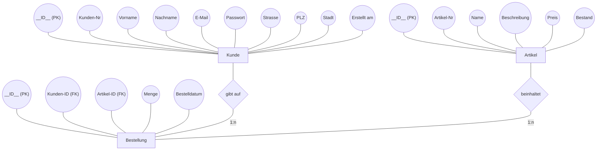
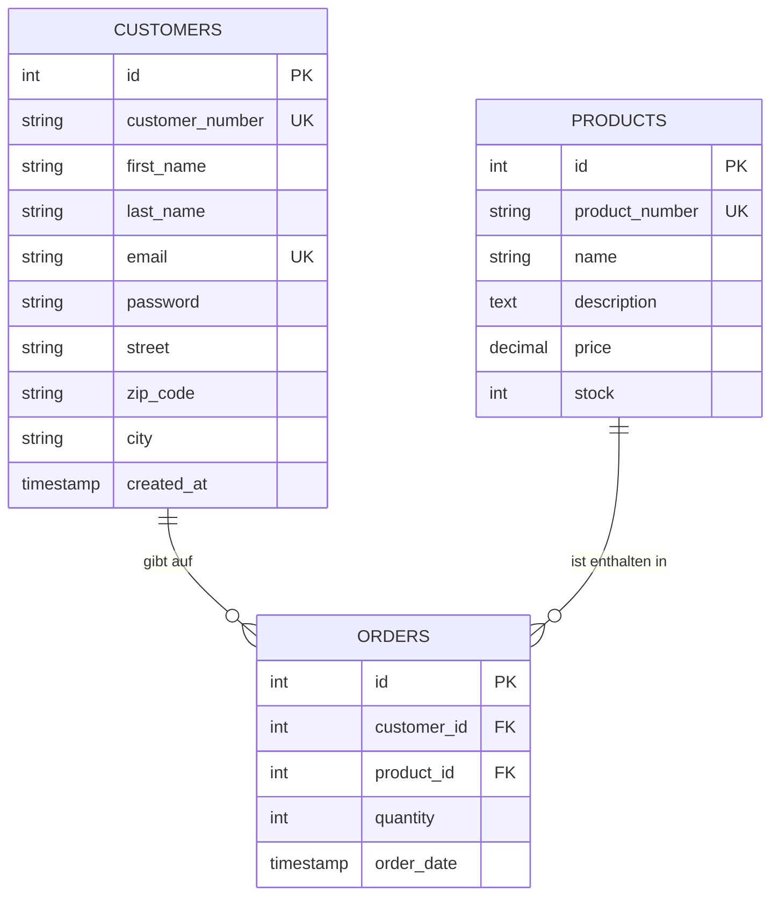
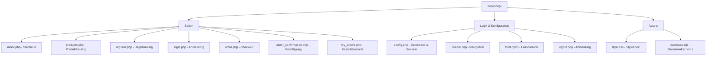

# PROJEKTDOKUMENTATION: BESE.CO Webshop
## Entwicklung einer E-Commerce Plattform für schwäbische Hardware (Besen)

**Fach:** Webentwicklung (HTML5, CSS3, PHP 8.x, MySQL)  
**Datum:** 05. Mai 2026

---

## 1. Projektübersicht
Das Projekt **BESE.CO** ist ein spezialisierter Online-Shop für handgefertigte Besen aus dem Schwarzwald. Die Plattform kombiniert traditionelles Handwerk mit moderner Webtechnologie und integriert den schwäbischen Dialekt als Alleinstellungsmerkmal.

### Kernfeatures:
- **Landingpage**: Professionelle Präsentation der Markenwerte mit Hero-Bereich und Verkaufsargumenten.
- **Kundenregistrierung**: Automatisierte Generierung von Kundennummern (z.B. K12345) und sichere Passwortspeicherung.
- **Login-System**: Session-basierte Authentifizierung mit E-Mail und Passwort.
- **Produktkatalog**: Dynamische Anzeige aller Artikel aus der Datenbank mit Preis und Direktbestellung.
- **Checkout-System**: Dreistufiger Bestellprozess mit Produktauswahl, Zahlungsmethode (Rechnung, PayPal, Kreditkarte, Vorkasse) und Live-Zusammenfassung.
- **Bestellbestätigung**: Detaillierte Übersicht nach Bestellabschluss mit Lieferadresse, Kundendaten und Zahlungsmethode.
- **Bestellübersicht**: Persönliche Bestellhistorie mit Stornierungsmöglichkeit.
- **Lagerverwaltung**: Automatische Bestandsreduzierung bei Bestellung und Wiederherstellung bei Stornierung.
- **Qualitätssicherung**: Detailliertes [Test- und Fehlerprotokoll](./TEST_PROTOKOLL.md).

---

## 2. Systemarchitektur & Datenbank
### 2.1 Datenbankmodell (ERM)
Die Datenhaltung erfolgt in einer relationalen MySQL-Datenbank. Das folgende Diagramm zeigt den logischen Aufbau (Chen-Notation) sowie die technischen Tabellenstrukturen:

#### Logisches Modell (Chen-Notation)

#### Technisches Modell (Crow's Foot Notation)

**Beziehungen:**
- Ein **Kunde** kann mehrere **Bestellungen** tätigen (1:n).
- Ein **Produkt** kann in mehreren **Bestellungen** vorkommen (1:n).

### 2.2 Sicherheit
- **SQL-Injection Schutz**: Konsequente Nutzung von **PDO Prepared Statements** in allen Datenbankabfragen.
- **Passwort-Sicherheit**: Einsatz von `password_hash()` mit dem `PASSWORD_DEFAULT` Algorithmus.
- **XSS-Prävention**: Konsequente Nutzung von `htmlspecialchars()` bei allen Benutzerausgaben.
- **Transaktionssicherheit**: Bestellvorgänge und Stornierungen werden in Datenbank-Transaktionen (`beginTransaction`, `commit`, `rollBack`) ausgeführt.
- **Zugriffsschutz**: Geschützte Seiten (Checkout, Bestellungen, Bestätigung) prüfen die Session und leiten nicht eingeloggte Benutzer zum Login weiter.

---

## 3. Technische Implementierung
### 3.1 Dateistruktur
Das Projekt ist modular aufgebaut, um Wartbarkeit und Übersichtlichkeit zu gewährleisten:

### 3.2 Seitenbeschreibung

| Datei | Beschreibung |
| :--- | :--- |
| `config.php` | Stellt die PDO-Datenbankverbindung her und startet die Session. Wird von allen Seiten über `header.php` eingebunden. |
| `header.php` | Rendert den HTML-Kopf und die Navigation. Zeigt je nach Login-Status unterschiedliche Menüpunkte an. |
| `footer.php` | Schliesst das HTML-Dokument mit dem Fussbereich ab. |
| `index.php` | Startseite mit Hero-Bereich und drei Verkaufsargumenten (Nachhaltig, Handgemacht, Schnelle Lieferung). |
| `products.php` | Zeigt alle Produkte aus der Datenbank in einer Tabelle mit Artikelnummer, Name, Beschreibung und Preis. Jedes Produkt hat einen "Bestellen"-Button. |
| `register.php` | Registrierungsformular für Neukunden. Erzeugt automatisch eine Kundennummer und loggt den Kunden nach Registrierung ein. |
| `login.php` | Login mit E-Mail und Passwort. Prüft die Eingaben gegen die Datenbank und startet eine Session. |
| `order.php` | Dreistufiger Checkout: 1) Produktauswahl per Dropdown, 2) Zahlungsmethode, 3) Live-Zusammenfassung mit Gesamtpreis. Prüft Lagerbestand und aktualisiert diesen nach Bestellung. |
| `order_confirmation.php` | Bestätigungsseite nach erfolgreicher Bestellung mit allen Details: Bestellnummer, Produkt, Lieferadresse, Kundendaten und Zahlungsmethode. |
| `my_orders.php` | Persönliche Bestellübersicht mit allen bisherigen Bestellungen. Jede Bestellung kann storniert werden (Datensatz wird gelöscht, Lagerbestand wird wiederhergestellt). |
| `logout.php` | Beendet die Session und leitet zur Startseite weiter. |
| `style.css` | Zentrales Stylesheet für alle Seiten. Modern Minimalist Design mit CSS-Variablen. |
| `database.sql` | SQL-Schema zum Erstellen der Datenbank, Tabellen und Beispieldaten. |

### 3.3 Frontend-Design
Das Design wurde nach dem **Modern Minimalist** Ansatz entwickelt:
- **Typografie**: System-Schriftart (Arial/Helvetica) für maximale Lesbarkeit.
- **Responsive Design**: Mobile-First Optimierung durch flexible Container und Media Queries.
- **User Experience**: Klare Call-to-Action Buttons, klickbare Zahlungskarten und intuitive Navigation.
- **Konsistenz**: Einheitliche Alert-Boxen (Erfolg/Fehler), CSS-Variablen für Farben und Abstände.

---

## 4. Installationsanleitung (Lokale Entwicklung)
Um den Webshop lokal (z.B. mit XAMPP) zu betreiben, folgen Sie diesen Schritten:

1. **XAMPP installieren**: Falls noch nicht vorhanden, XAMPP von [apachefriends.org](https://www.apachefriends.org) herunterladen und installieren.
2. **Webserver starten**: Apache und MySQL im XAMPP Control Panel aktivieren.
3. **Datenbank anlegen**: `phpMyAdmin` öffnen (`http://localhost/phpmyadmin`), eine neue Datenbank mit dem Namen `beseshop` erstellen.
4. **Schema importieren**: Im Tab "Importieren" die Datei `database.sql` hochladen und ausführen. Dadurch werden alle Tabellen und Beispieldaten erstellt.
5. **Dateien kopieren**: Das gesamte Projektverzeichnis `beseshop/` in den XAMPP-Ordner `htdocs/` verschieben.
6. **Aufrufen**: `http://localhost/beseshop/index.php` im Browser öffnen.

### Test-Zugangsdaten (aus den Beispieldaten):
| E-Mail | Passwort | Name |
| :--- | :--- | :--- |
| `max@mustermann.de` | `passwort123` | Max Mustermann |
| `anna@schmidt.de` | `passwort123` | Anna Schmidt |

---

## 5. Benutzerführung (Anleitung)

### Als Gast (nicht eingeloggt):
1. **Startseite** ansehen (`index.php`).
2. **Produkte** durchstöbern (`products.php`).
3. **Registrieren** (`register.php`) oder **einloggen** (`login.php`).

### Als eingeloggter Kunde:
1. **Produkt bestellen**: Auf "Bestellen" bei einem Produkt klicken oder über den Menüpunkt "Bestellen" direkt zum Checkout gelangen.
2. **Checkout durchlaufen**: Produkt und Menge wählen, Zahlungsmethode auswählen, Zusammenfassung prüfen und "Jetzt bestellen" klicken.
3. **Bestätigung erhalten**: Nach erfolgreicher Bestellung wird eine Bestätigungsseite mit allen Details (Lieferadresse, Zahlungsmethode, Gesamtbetrag) angezeigt.
4. **Bestellungen einsehen**: Unter "Meine Bestellungen" alle bisherigen Bestellungen ansehen.
5. **Bestellung stornieren**: In der Bestellübersicht den Button "Stornieren" klicken. Die Bestellung wird gelöscht und der Lagerbestand wiederhergestellt.

---

## 6. Fazit & Ausblick
Das Projekt demonstriert erfolgreich die Umsetzung einer funktionalen CRUD-Applikation mit PHP und MySQL. Der komplette Bestellprozess von der Produktauswahl über den Checkout bis zur Stornierung ist implementiert und funktionsfähig.

**Geplante Erweiterungen:**
- Integration eines interaktiven Warenkorbs fuer Mehrprodukt-Bestellungen.
- Admin-Dashboard zur Bestandsverwaltung und Bestellabwicklung.
- E-Mail-Benachrichtigungen bei Bestelleingang und Stornierung.
